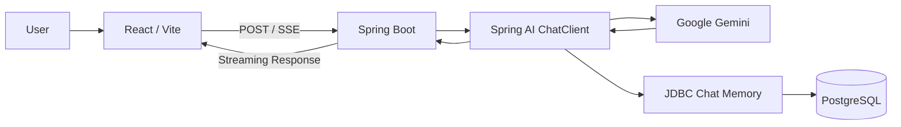

# 🌏 LocalMate AI

> 부산과 경주 여행을 위한 Spring AI 기반 다국어 관광 컨시어지

LocalMate AI는 여행자가 지역과 답변 언어를 선택하고 관광지, 교통, 음식,
문화와 여행 일정에 관해 질문할 수 있는 개인 프로젝트입니다. Gemini의
응답을 실시간으로 제공하고, 대화 문맥을 기억하며, 생성된 여행 코스만
별도의 PDF로 저장할 수 있습니다.

---

## ✨ 현재 구현 기능

- 부산 / 경주 지역 선택
- 한국어 / 영어 / 일본어 / 중국어 답변
- Gemini 기반 AI 관광 상담
- SSE 기반 실시간 응답 Streaming
- conversationId 기반 JDBC Chat Memory
- 새 대화 생성 및 진행 중인 요청 취소
- Markdown 제목, 목록, 표 렌더링
- DOMPurify 기반 AI 응답 HTML 정제
- 상세 여행 코스 및 시간순 일정표 생성
- AI 답변에서 여행 코스 구간만 추출
- 여행 코스 A4 PDF 다운로드
- PDF 페이지 분할, 본문·표 넘침 및 줄바꿈 처리
- 데스크톱 / 모바일 반응형 채팅 UI

### 여행 코스 PDF

일정이나 추천 코스가 포함된 AI 답변은 시스템 프롬프트의
`COURSE_START` / `COURSE_END` 마커로 내보낼 구간을 구분합니다.
프런트엔드는 해당 구간이 있는 완료 답변에만 PDF 버튼을 표시합니다.

PDF에는 다음 내용이 포함됩니다.

- 지역, 답변 언어, 생성일
- 코스 개요와 총 소요 시간
- 시간순 일정표
- 방문지별 설명과 실용 팁
- 장소 간 이동 방법
- 식사, 예약, 날씨와 대체 일정

---

## 🛠 기술 스택

### Backend

- Java 21
- Spring Boot 4.1.0
- Spring AI 2.0.0
- Spring MVC
- Spring Data JDBC
- Gradle

### AI

- Google Gemini
- Spring AI ChatClient
- MessageChatMemoryAdvisor

### Frontend

- React 19
- Vite 8
- Marked
- DOMPurify
- html2pdf.js

### Database / Infrastructure

- PostgreSQL 16
- Docker Compose
- Git / GitHub

---

## 🏗 현재 아키텍처



관광지·음식 데이터 기반 Tool Calling은 아직 구현 전이며 다음 개발 단계에
추가할 예정입니다.

---

## 📂 프로젝트 구조

```text
localmate-ai/
├── src/
│   ├── main/
│   │   ├── java/com/localmate/ai/
│   │   │   ├── config/       # ChatClient와 시스템 프롬프트
│   │   │   ├── controller/   # 채팅 및 페이지 요청
│   │   │   ├── dto/          # 채팅 요청·응답
│   │   │   └── service/      # ChatClient 호출과 Streaming
│   │   └── resources/
│   │       └── application.yaml
│   └── test/
├── frontend/
│   ├── src/
│   │   ├── App.jsx           # 채팅, SSE, Markdown, PDF 기능
│   │   └── App.css           # 반응형 UI와 PDF 스타일
│   ├── package.json
│   └── vite.config.js
├── docs/                     # 설계 및 구현 문서
├── compose.yml               # PostgreSQL
├── build.gradle
└── README.md
```

---

## 🚀 실행 방법

### 사전 준비

- JDK 21
- Node.js 20.19 이상 또는 22.12 이상
- Docker 및 Docker Compose
- Google AI Studio에서 발급한 Gemini API Key

### 1. PostgreSQL 실행

```bash
docker compose up -d
```

기본 데이터베이스 설정은 다음과 같습니다.

| 항목 | 값 |
|------|----|
| Host | `localhost` |
| Port | `5432` |
| Database | `localmate` |
| Username | `localmate` |
| Password | `localmate` |

### 2. Gemini API Key 설정

프로젝트 루트에 Git으로 관리되지 않는 `.env` 파일을 생성합니다.

```properties
GOOGLE_API_KEY=your_gemini_api_key
```

또는 현재 셸의 환경변수로 설정할 수 있습니다.

```bash
export GOOGLE_API_KEY='your_gemini_api_key'
```

API Key를 변경한 경우 기존 백엔드 프로세스와 Gradle daemon을 종료한 뒤
다시 실행해야 합니다.

```bash
./gradlew --stop
```

### 3. 백엔드 실행

```bash
./gradlew bootRun
```

백엔드는 `http://localhost:8080`에서 실행됩니다.

### 4. 프런트엔드 실행

```bash
cd frontend
npm install
npm run dev
```

Vite 개발 서버는 기본적으로 `http://localhost:5173`에서 실행되며,
`/api` 요청을 `http://localhost:8080`으로 전달합니다.

---

## 📡 API

### 일반 AI 응답

```http
POST /api/chats
Content-Type: application/json
```

### Streaming AI 응답

```http
POST /api/chats/stream
Content-Type: application/json
Accept: text/event-stream
```

### Request

```json
{
  "conversationId": "chat-1",
  "region": "BUSAN",
  "language": "ENGLISH",
  "message": "Recommend a one-day course in Busan."
}
```

새 대화는 별도 API를 호출하지 않습니다. 프런트엔드에서 새로운 UUID를
발급하고 로컬 대화 상태를 초기화합니다.

자세한 내용은 [API 명세](docs/06_API_SPEC.md)를 참고하세요.

---

## ✅ 검증

### Backend

```bash
./gradlew test
```

### Frontend

```bash
cd frontend
npm run lint
npm run build
```

현재 백엔드 테스트, 프런트엔드 린트와 프로덕션 빌드가 모두 통과합니다.
Vite의 500 kB 초과 번들 메시지는 빌드 실패가 아닌 최적화 경고입니다.

---

## 📄 문서

- [프로젝트 계획](docs/01_PROJECT_PLAN.md)
- [요구사항](docs/02_REQUIREMENTS.md)
- [화면 설계](docs/03_WIREFRAME.md)
- [시스템 아키텍처](docs/04_ARCHITECTURE.md)
- [ERD](docs/05_ERD.md)
- [API 명세](docs/06_API_SPEC.md)
- [WBS](docs/07_WBS.md)
- [트러블슈팅](docs/08_TROUBLE_SHOOTING.md)
- [회고](docs/09_RETROSPECT.md)
- [사용자 흐름](docs/11_USER_FLOW.md)
- [프롬프트 설계](docs/12_PROMPT_DESIGN.md)
- [서비스 정책](docs/13_SERVICE_POLICY.md)
- [데이터베이스 설계](docs/14_DATABASE_DESIGN.md)
- [AI Tool 설계](docs/15_AI_TOOL_DESIGN.md)
- [시스템 프롬프트](docs/16_SYSTEM_PROMPT.md)
- [테스트 시나리오](docs/17_TEST_SCENARIO.md)
- [프로젝트 로드맵](docs/18_PROJECT_ROADMAP.md)

---

## 🗺 로드맵

### v2 — 구조화된 관광 정보

- TourSpotTool과 관광지 데이터 조회
- 관광지 카드와 즐겨찾기
- FoodTool과 음식 카드
- 여행 조건 입력형 일정 플래너
- 일정 저장 및 불러오기

### v3 이후

- 지도 기반 코스 동선
- 실시간 날씨·교통 정보
- 관광 문서 기반 RAG와 출처 표시
- 음성 질문 및 다국어 음성 안내
- 서울·제주 및 전국 지역 확장

자세한 단계는 [프로젝트 로드맵](docs/18_PROJECT_ROADMAP.md)을 참고하세요.

---

## 👤 Author

**Nari**

Spring Boot & Spring AI Developer

---

## 📜 License

MIT License
