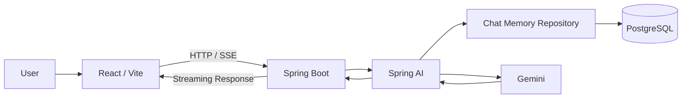

# 🏗 System Architecture

---

## Spring AI 구성

- ChatClient
- JDBC ChatMemory
- SSE Streaming
- Gemini Chat Model
- System Prompt 기반 지역·언어·여행 코스 출력 제어

## 현재 프런트엔드 구성

- React 단일 채팅 화면
- Fetch ReadableStream 기반 SSE 처리
- Marked 기반 Markdown 변환
- DOMPurify 기반 HTML 정제
- html2pdf.js 기반 여행 코스 PDF 저장

## 향후 구성

- TourSpotTool / FoodTool 등 Tool Calling
- 관광 도메인 데이터베이스
- 지도 API와 RAG
