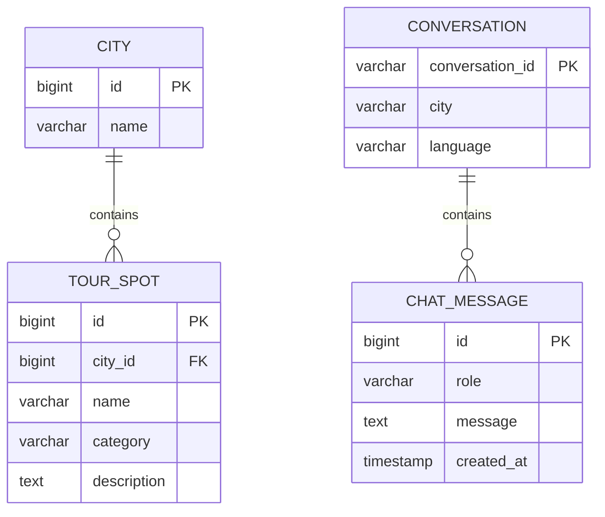

# 🗄 ERD

> 구현 상태: 현재 PostgreSQL에는 Spring AI JDBC ChatMemory 스키마가 사용된다.
> 아래 ERD의 관광 및 대화 도메인 테이블은 향후 Tool Calling과 대화 내역
> 기능을 위한 설계안이며 아직 별도 Entity로 구현되지 않았다.

---

## 설명

CITY

↓

관광지 관리

↓

대화 저장

↓

ChatMemory
